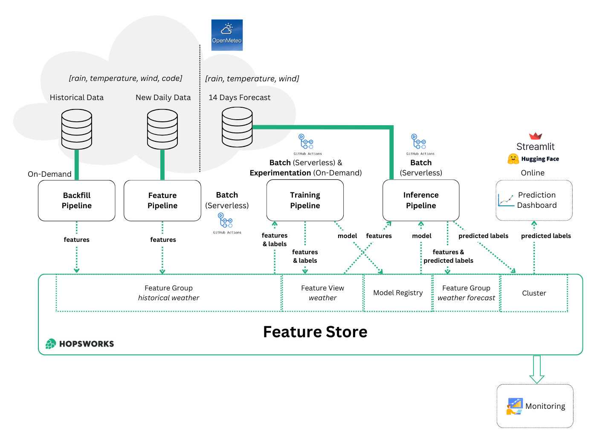

 

# Weather Code Prediction using Serverless ML Services

Author: Marco Pellegrino - November 2023

## Overview

This project uses Python and Hopsworks to forecast the weather code for Stockholm based on historical weather data. The predictive model, trained using machine learning techniques, provides public access to its forecasts through a user-friendly [web application](https://huggingface.co/spaces/marcopellegrino/predict-weather-code).

## Table of Contents

1.  [Description](#description)
2.  [Data Sources](#data-sources)
3.  [Architecture](#architecture)
4.  [Usage](#usage)
5.  [Built with](#built-with)
6.  [License](#license)

## Description

This project aims to forecast the daily weather code for Stockholm, utilizing key meteorological factors such as minimum temperature, precipitation sum, and maximum gust speed. The latter feature selection is informed by an intuitive understanding of the factors that influence weather conditions.

The project workflow involves the following steps in order:

1. [Historical Data Collection](#1-backfill-pipeline): Historical weather data of the past 3 months is initially retrieved.

2. [Daily Data Collection](#2-feature-pipeline): Every day, weather information of the previous day is collected.

3. [Machine Learning Model Training](#3-training-pipeline): With the updated data, a new machine learning model is trained and stored in the collection of trained models.

4. [Weather Code Forecast](#4-inference-pipeline): Minimum temperature, precipitation sum, and maximum gust speed for the next 14 days are collected and used as model features. Using the best-trained model, a weather code forecast is generated for the upcoming 2 weeks.

This iterative process ensures that the predictive model adapts to the latest data, enhancing the accuracy of the weather forecasts over time.

## Data Sources

The weather data, including historical records, daily updates, and forecast features is freely sourced from [Open-Meteo](https://open-meteo.com/en/docs).

Retrieved features for each day:

*   Weather code: weather conditions as a numeric code and categorized by [WMO mapping](resources/weather_code_mapping.csv)
*   Minimum temperature reached during the day, in °C
*   Sum of daily precipitation, in mm
*   Maximum gusts speed on the day, in km/h

## Architecture

### Settings
All parameters and settings related to Hopsworks, the ML model, and [Open-Meteo](https://open-meteo.com/en/docs) are easily modifiable in the  [configuration file `config.py`](config.py)

### 1. Backfill pipeline
[Source code](notebooks/1_weather_code_feature_backfill.ipynb)
The pipeline is run on-demand, to create and populate the Hopsworks Feature Group with historical weather information.
Daily weather code, minimum temperature, sum of daily precipitation, and maximum gusts speed are collected for the past 3 months from [Open-Meteo](https://open-meteo.com/en/docs).

### 2. Feature Pipeline
[Source code](notebooks/2_weather_code_feature_pipeline.ipynb)
The pipeline is run on batch processing, every day at 07:00 UTC using GitHub Actions, to collect the previous day weather and insert it into the Hopsworks Feature Group.
Daily weather code, minimum temperature, sum of daily precipitation, and maximum gusts speed are collected for the previous day from [Open-Meteo](https://open-meteo.com/en/docs).
Note: The chosen runtime aligns with the release pattern of [Open-Meteo](https://open-meteo.com/en/docs), which provides information for the previous day within the first 6 hours of the day.

### 3. Training Pipeline
[Source code](notebooks/3_weather_code_training_pipeline.ipynb)
The pipeline is run on batch processing using GitHub Action, after the feature pipeline, so that a new ML model is trained using the newest data for a more accurate forecast. However, the pipeline can also be run on-demand for experimentation.
1. A Hopsworks Feature View is created from the Hopsworks Feature Group that contains the collected weather information. Feature Views have the capability of joining multiple Feature Groups, however here there is only one Feature Group. Multiple Feature Groups can be added later to incorporate more data sources.
2. A Hopsworks Fraining Dataset from the Feature View is created and retrieved.
3. An XGBoost regression model is built, and its hyperparameters are tuned with a random search optimized with k-fold cross-validation.
4. The regression model is evaluated with R2, MSE, RMSE and weighted-average F1 score F1-score metrics on k-fold cross-validation. The weather code label is the numeric output of a regression model but is also classified into the closest integer weather code class. In addition, a random 80% training and 20% test set split are computed to perform an in-depth F1 score analysis. Model residuals, feature importance, MSE on full training and test for overfitting identification, and learning curve are also computed for a complete model evaluation.
5. The model is inserted in the Hopsworks Model Registry.

### 4. Inference Pipeline
[Source code](notebooks/4_weather_code_batch_inference.ipynb)
The pipeline is run on batch processing using GitHub Action, after the training pipeline, because new forecasts are computed every day once the new data is collected and the model trained.
1. The best-trained ML model is retrieved from the Hopsworks Model Registry. As a modeling choice, it is also possible to use the latest model even if it performs worse than others.
2. Daily minimum temperature, sum of daily precipitation, and maximum gusts speed are collected for the next 14 days from [Open-Meteo](https://open-meteo.com/en/docs).
3. the ML model is used to predict the weather code for the next 2 weeks.
4. Forecasts are stored in a HopsworksFeature Group. Predictions are also stored in the Hopsworks cluster, overriding the forecasts of the previous day, by providing direct and fast access for the web application.

### 5. Web App
[Source code](webapp/app.py)
The web application establishes a connection to the Hopsworks cluster, retrieving the latest forecast. This data is then visualized in a table, color-coded based on weather codes, and presented in a trend plot.

## Usage

1.  Install the required dependencies: `pip install -r requirements.txt`
2.  Set up [Howsworks account](https://app.hopsworks.ai/)
3.  Set up GitHub Actions with the [`feature-pipeline-action.yml`](.github/workflows/pipelines-action.yml) configuration files. It automates the feature, training, and inference pipelines one after the other.
4.  Run web app locally: `cd webapp` and `python -m streamlit run app.py`, or deploy it on [Hugging Face](https://huggingface.co/)

## Built with

*   [Hopsworks](https://www.hopsworks.ai/)
*   [GitHub Actions](https://github.com/features/actions)
*   [Streamlit](https://streamlit.io/) and [Hugging Face](https://huggingface.co/)

## License

This repository is licensed under the GNU General Public License v3.0 (GPL-3.0). For more details, see the [LICENSE](LICENSE) file.
